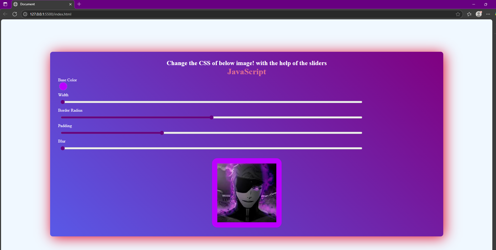

# ChangeStyle
A mini JavaScript project that lets users change an image’s style in real time using sliders and a color picker. Users can adjust width, padding, border radius, blur, and background color dynamically.

